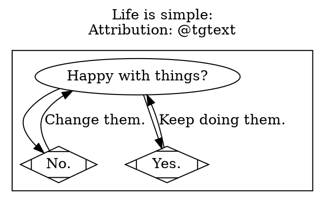
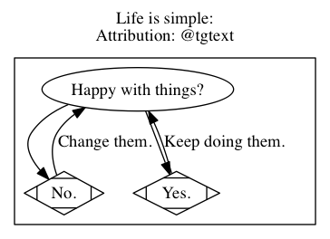
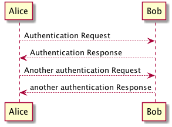
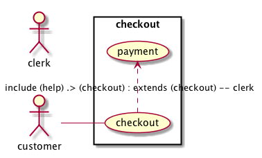
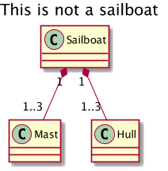
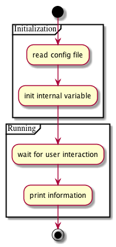
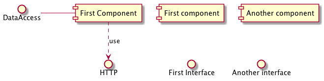
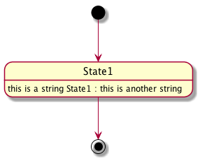
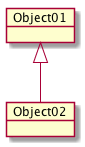

# Ditaa

    ID: org_gcr_2017-05-13_mara:1F041707-87E7-4490-8F29-996C02CAE757

When a drop of water joins the ocean it becomes the ocean.

```ditaa
+---------+
| cBLU    |
|         |
|    +----+
|    |cBLU|
|    |    |
+----+----+
```


```ditaa
+----------+1       1…3+------+
| Sailboat +◆----------+ Mast |
+-----+----+           +------+
      ◆1
      |
      |             1…2+------+
      +----------------+ Hull |
                       +------+
      This is not a sailboat
```


# Graphviz

    ID: org_gcr_2017-05-13_mara:26F93EEA-E64B-439A-BAF6-1BB7F5182D12






# PlantUML

    ID: org_gcr_2017-05-13_mara:ADF3A220-77D0-4635-BB50-D9AF82A803E2


## **Sequence Diagram**

    ID: org_gcr_2017-05-13_mara:EEDE4AC4-E400-470F-BD6E-9D921E8FD016

-   Feature rich.
-   Information rich.

```plantuml
Alice --> Bob: Authentication Request
Bob --> Alice: Authentication Response

Alice --> Bob: Another authentication Request
Alice <-- Bob: another authentication Response
```




## **Use Case Diagram**

    ID: org_gcr_2017-05-13_mara:8223D025-909D-4B14-A5C2-D939FB2F7E5F

-   Actor variable aliasing feature.

```plantuml
left to right direction
skinparam packageStyle rect
actor customer
actor clerk
rectangle checkout {
customer -- (checkout)
(checkout) .> (payment) : include (help) .> (checkout) : extends (checkout) -- clerk
}
```




## **Class Diagram**

    ID: org_gcr_2017-05-13_mara:E0596CAD-4A2C-4230-860F-077FA6E0EB04

-   Valuable for all sorts of ideas in addition to classes.
-   `hide`, `show`, and `include` are mentioned.
    -   Could be a great reuse mechanism combined with noweb and tangling.
-   Spotted characters might be useful to indicating other things.
    -   Example is data which is clearly a first-class citizen.
    -   Six package visualization types.
    -   Packaging vs. namespaceing.
    -   Good support for splitting large images among output pages.

```plantuml
title This is not a sailboat
scale 200 width
Sailboat "1" *-- "1..3" Mast
Sailboat "1" *-- "1..3" Hull
```




## **Activity Diagram**

    ID: org_gcr_2017-05-13_mara:31FDFA62-F14F-48CB-9EFD-997EF9EE92BF

-   May indicate top to bottom flow using `top`.
-   May label arrows.
-   May force arrow direction.
-   if/else structure for branching.
-   Partition construct.
-   [New syntax](http://plantuml.sourceforge.net/activity2.html) with more examples.

```plantuml
start
partition Initialization {
:read config file;
:init internal variable;
}
partition Running {
:wait for user interaction;
:print information;
}

stop
```




## **Component Diagram**

    ID: org_gcr_2017-05-13_mara:029E7ABD-6F38-412E-ABF4-0A202D7E47EF

-   The names to define all of the diagram entity types.
-   Identify &ldquo;Modern UML&rdquo;.
-   Good for summaries.

```plantuml
[First component]
[Another component]
() "First Interface"
() "Another interface" as Interf2
DataAccess - [First Component]
[First Component] ..> HTTP : use
```




## **State Diagram**

    ID: org_gcr_2017-05-13_mara:558F580B-2F94-4A23-9EEB-9DC00BB3B19C

```plantuml
[*] --> State1
State1 --> [*]
State1 : this is a string State1 : this is another string
```




## **Object Diagram**

    ID: org_gcr_2017-05-13_mara:34FC630D-40D9-4E93-8AD9-FD682B32454E

```plantuml
object Object01
object Object02
Object01 <|-- Object02
```




## **Options**

    ID: org_gcr_2017-05-13_mara:F9F5B9E8-5B8F-4791-9516-880788A0667F

-   Commands.
    -   Header and footer values.
    -   Zoom level.
    -   Creole markup for most text elements.
    -   Lists and sub-lists.
    -   Horizontal lines. Will appear in most containers.
    -   Headings.
    -   Plain old HTML.
    -   Tables, LaTeX style.
    -   Use [OpenIconic icons](https://useiconic.com/open) anywhere.

-   Fonts and colors.
    -   You can change just about everything.
    -   You may nest definitions.
    -   `monochrome true` option.
        -   If you are printing
        -   Or don&rsquo;t want color.

-   Internationalization.
    -   Full Unicode character support.
